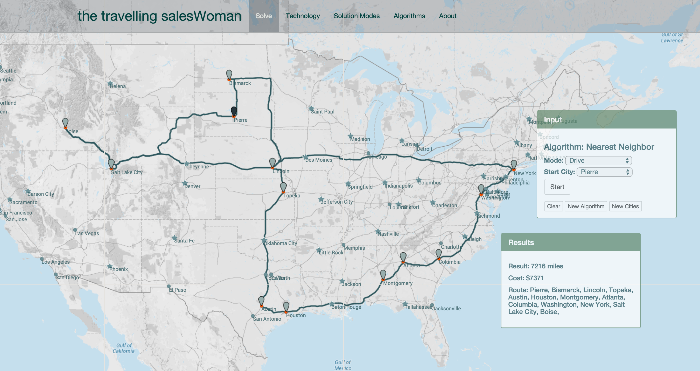

<h1>The Travelling Saleswoman</h1>

Heroku Deployment: <a href = "http://tspapp.herokuapp.com/">http://tspapp.herokuapp.com/</a>

The Developer: <a href = "https://www.linkedin.com/in/fcoggins">https://www.linkedin.com/in/fcoggins</a>

The Travelling Saleswoman provides a tool to visualize the classic computer science travelling 
salesman optimization problem. This visualization tool provides the ability to select a 
subset of US cities. Choices of "Nearest Neighbor", "Hillclimb" and "Simulated Annealing" algorithms allow comparisons
of various solution methods. Solution modes include "As-the-crow-flies", "Drive", or "Fly" with the latter two modes
utilizing Directions from Google Directions API and Flight data from Google's QPX Express API.

<h2>Technology Stack</h2>
<ul>
<li>Python</li>
<li>Flask</li>
<li>Google Maps API</li>
<li>Google Directions API</li>
<li>QPX Express API</li>
<li>SQLite/SQLAlchemy</li>
<li>Javascript/JQuery/JQuery UI</li>
<li>HTML/CSS/Bootstrap</li>
</ul>

<h2>File Guide</h2>
<ul>
<li>model.py</li>
<li>tsp.py: calculate distance matrix, solution algorithms</li>
<li>tspapp.py: controls the Flask app</li>
<li>static/js/tsp.js: user interactions</li>
</ul>

<h2>Solution Modes</h2>
<ul>
<li>As the Crow Flies

Distance between cities is calculated using the spherical law of 
  cosines to approximate the curvature of the earth.
</li>
<li>Drive

The Google Directions API was used to find the best route between two
  cities. The JSON request sent latitude and longitude for the city. The
  returned data included total road distance between the endpoints and 
  encoded polyline data to use for drawing the route and is stored in 
  a PostgreSQL database. Thredaing is used to load data in the background 
  at runtime.
</li>

Results show total tour miles and tour cost assuming $.56 per mile to
  drive and $30/hour for our saleswomn's time.
<li>Fly Commercial
  
Google's QPX Express API was queried for December 15, 2014 and the 10
    least expensive routes were returned. The cost and time for each of
    the 10 options was stored in the PostgreSQL database. At run time, the best
    option is selected based on the optimum combination of fare and time. This
    weight was applied to the edges for optimization. The distance matrix
    in this mode is not symetric since the cost from city A to B does not necessarily
    equal the cost from city B to A.

  
Total cost was calculated by adding the fares for the tour and the 
  travel cost of $30/hour.
   
</li>
</ul>

<h2>Algorithms</h2>
<h3>Nearest Neighbor</h3>

Nearest neighbor simply takes the starting city and simplistically
travels to the next available city. The process is repeated until the
possibilities are exhausted and the loop is closed. This solution more
often then not is far from optimum.

<h3>Hillclimb</h3>

Hillclimb explores neighboring solution states by employing a move
operator. An initial random solution is found and then a neighboring
state is evaluated. If the neighbor state results in a better solution
then it is accepted and the process is repeated until no better solutions
can be found.

The choice of move operator determines the neighbor state:
<ul>
  <li>Swap cities - the order of two successive cities is reversed.</li>
  <li>Swap edges - two edges are disconnected and reconnected to the 
    other's endpoints.</li>
</ul>

The problem with the simple Hillclimb is that there may exist many local
maxima that are not the global maxima. The Hillclimb method can get stuck
at one of these. The method can be run repeatedly up to a specified number
of tries a more sophisticated method can be used such as...
<h3>Simulated Annealing</h3>

In order to avoid the problem of local maxima, SA will temporarily accept 
less than optimal solutions. A probability function that decreases over time
determines whether less than optimal solutions are chosen.

In this implementation a better solution is always selected and a probability function
determines whether a sub-optimal value will be accepted. The probability function 
starts out liberal and becomes more conservative over time, thus narrowing in on 
a solution.

<h3>The steps on the journey...</h3>
  <ul>
    <li>Static as-the-crow-flies solution with random points</li>
    <li>Static as-the-crow-flies solution with cities on the map</li>
    <li>Visualize the solution steps by introducing animation</li>
    <li>Work with Google's direction API to get road miles and polylines</li>
    <li>Animate the solution for road miles</li>
    <li>Optimize to improve runtime</li>
    <li>Add ability to select a subset of cities from a select list or by
      clicking directly on the map</li>
    <li>Add the Air route data</li>
  </ul>

<h2>Additional Screenshots</h2>

